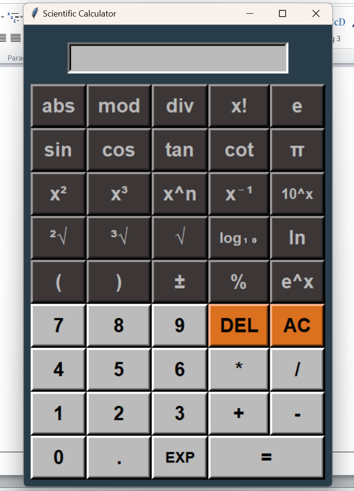
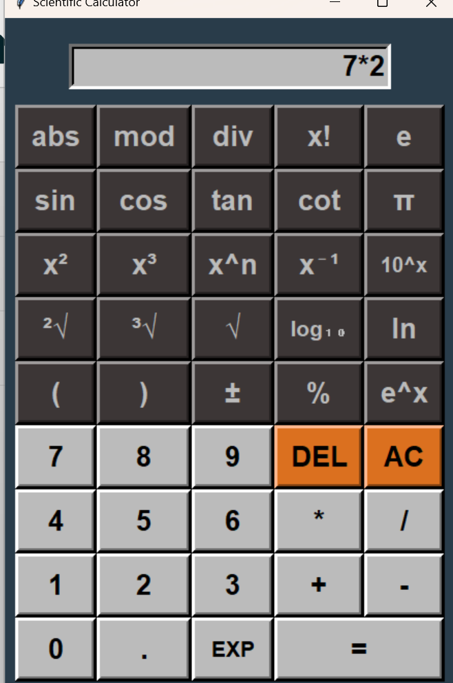

# Aim/Overview of the practical: 

The aim of this practical is to develop a fully functional Scientific Calculator using Python's Tkinter library,
capable of performing a wide range of mathematical operations such as basic arithmetic, trigonometric functions, 
logarithmic functions, exponentiation, and roots, all through a graphical user interface (GUI).

# Task to be done:

	Set Up the Development Environment:
•	Install Python and ensure Tkinter is available.
•	Set up the IDE (e.g., VS Code, PyCharm) for development.

	Design the GUI Layout:
•	Create a calculator window using Tkinter.
•	Add an entry field to display the input and results.
•	Design the layout using a grid system to arrange buttons.

	Implement Button Functions:
•	Develop functions for basic arithmetic operations (addition, subtraction, multiplication, division).
•	Implement trigonometric functions (sin, cos, tan, cot).
•	Add functions for advanced operations like square roots, cube roots, nth roots, and powers.
•	Implement factorial, percentage, and sign change functionality.

	Integrate Display Handling:
•	Ensure user input is displayed dynamically in the entry field.
•	Allow continuous expression building by appending numbers and operators.
	Error Handling:
•	Handle invalid input cases like division by zero, negative square roots, or other mathematical exceptions.
•	Display appropriate error messages when necessary.

	Clear, Delete, and Equal Functions:
•	Implement a clear button to reset the input.
•	Create a delete button to remove the last character.
•	Develop the equal button function to evaluate and display the result of the current expression.

	Enhance with Constants and Special Buttons:
•	Add constants like π (pi) and e (Euler’s number) to the calculator.
•	Implement buttons for exponentiation and logarithmic functions (log base 10 and natural log).

	Test the Calculator:
•	Perform thorough testing of all buttons and functions to ensure correctness.
•	Test edge cases such as invalid input, large numbers, and special cases.

	Refine the User Interface:
•	Adjust button sizes, colors, and fonts for a more user-friendly experience.
•	Ensure the GUI responds well to different screen sizes.

	Finalize the Code and Documentation:
•	Clean up the code for readability and maintainability.
•	Document the code with comments explaining key parts.
•	Prepare a project report or presentation if necessary.

